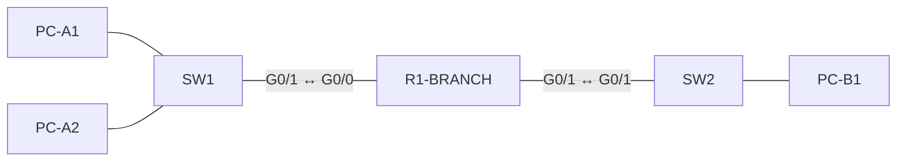

# Lab 01: Branch Office Bring-Up

**Topics:** Subnetting (FLSM) · IPv4 addressing · Basic device security · Switch management IP
**Estimated time:** 45–60 minutes
**Exam style:** Simulation item. Configure the devices to meet every requirement.

---

## Scenario

A new branch office is opening with two departments, Sales and Admin. You have been assigned the network **192.168.50.0/24**. Divide it into **four equal subnets** and bring up the branch router and switches. The router must also be hardened before it goes into production.

## Topology



| Device | Model | Notes |
|---|---|---|
| R1-BRANCH | 2911 | G0/0 → Sales LAN, G0/1 → Admin LAN |
| SW1 | 2960 | Sales switch, uplink G0/1 |
| SW2 | 2960 | Admin switch, uplink G0/1 |
| PC-A1, PC-A2 | PC | Sales, connect to SW1 Fa0/1 and Fa0/2 |
| PC-B1 | PC | Admin, connect to SW2 Fa0/1 |

---

## Tasks

> **Guidelines:** Do not use a subnet calculator. Use only the address block given. Save the configuration on every device when you finish.

### Part 1: Subnetting

Divide 192.168.50.0/24 into four equal subnets. Fill in this table before you configure anything.

| Subnet | Network address | First usable | Last usable | Broadcast |
|---|---|---|---|---|
| 1st (reserved) | | | | |
| 2nd (Sales) | | | | |
| 3rd (Admin) | | | | |
| 4th (reserved) | | | | |

Subnet mask in dotted decimal: `_______________`

### Part 2: Addressing

1. **Sales uses the 2nd subnet.** Assign the **first** usable address to R1-BRANCH G0/0.
2. **Admin uses the 3rd subnet.** Assign the **first** usable address to R1-BRANCH G0/1.
3. Assign PC-A1 the **last** usable Sales address and PC-A2 the **second-to-last**.
4. Assign PC-B1 the **last** usable Admin address.
5. Set the default gateway on every PC.
6. Add the interface descriptions `LAN-SALES` and `LAN-ADMIN` to the router interfaces.

### Part 3: Device security on R1-BRANCH

7. Set the hostname to `R1-BRANCH`.
8. Protect privileged EXEC mode with a password stored as a **hash**.
9. Require a password on the console line.
10. Make sure no password appears in plain text in the running configuration.
11. Configure a message-of-the-day banner: `Authorized access only`.

### Part 4: Switch management

12. Set the hostname of each switch.
13. Give SW1 a management IP address. Use the **third-to-last** usable Sales address.
14. SW1 must be reachable from PC-B1 in the Admin subnet.

---

## Verification

Run these commands and answer the questions. On the real exam, questions like these follow the lab or appear as exhibits.

```
R1-BRANCH# show ip interface brief
R1-BRANCH# show ip route
R1-BRANCH# show running-config
SW1# show ip interface brief
PC-B1> ping <SW1 management IP>
```

1. How many usable host addresses does each subnet have?
2. In `show ip route`, how many **C** routes and how many **L** routes appear for 192.168.50.0? What prefix length do the L routes use?
3. After Task 10, what number appears between `password` and the encrypted string on the console line? What does it mean?
4. PC-B1 can ping R1-BRANCH G0/0 but **not** SW1. Which single SW1 command is most likely missing?
5. A user in Sales is configured as 192.168.50.127. Why can't that address be assigned to a host?

When you're done, check your work against [solution.md](solution.md).
