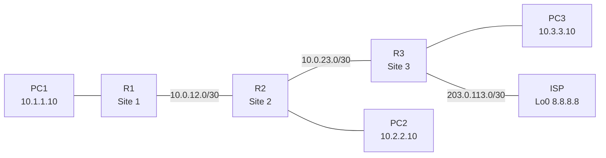

# Lab 02: Three-Site Static Routing

**Topics:** Static routes · Default routes · Longest-prefix match · Routing troubleshooting
**Estimated time:** 60–75 minutes
**Exam style:** Part A is a simulation item. Part B is a set of troubleshooting tickets with exhibits.

---

## Scenario

A company has three sites connected in a line and one internet connection at Site 3. Configure static routing so every LAN can reach every other LAN and the internet. The ISP router is simulated, and its loopback **8.8.8.8** stands in for the internet.

## Topology



## Addressing table

| Device | Interface | IP address | Connects to |
|---|---|---|---|
| R1 | G0/0 | 10.1.1.1/24 | LAN 1 (PC1) |
| R1 | G0/1 | 10.0.12.1/30 | R2 G0/0 |
| R2 | G0/0 | 10.0.12.2/30 | R1 G0/1 |
| R2 | G0/1 | 10.0.23.1/30 | R3 G0/0 |
| R2 | G0/2 | 10.2.2.1/24 | LAN 2 (PC2) |
| R3 | G0/0 | 10.0.23.2/30 | R2 G0/1 |
| R3 | G0/1 | 10.3.3.1/24 | LAN 3 (PC3) |
| R3 | G0/2 | 203.0.113.2/30 | ISP G0/0 |
| ISP | G0/0 | 203.0.113.1/30 | R3 G0/2 |
| ISP | Loopback0 | 8.8.8.8/32 | Simulated internet |
| PC1 / PC2 / PC3 | NIC | .10 in their LAN | Gateway = router's .1 |

All routers are 2911s. You can connect each PC directly to its router, or through a 2960 switch.

---

## Setup (do this first)

Configure every interface in the addressing table, including the ISP. Then give the ISP router this route back to the company, which stands in for the NAT a real ISP connection would use:

```
ISP(config)# ip route 10.0.0.0 255.0.0.0 203.0.113.2
```

---

## Part A: Configuration tasks

> **Guidelines:** Use **static routes only**. Don't configure a dynamic routing protocol. Don't add routes on the ISP router beyond the setup route. Save every router's configuration when finished.

1. **R1** is a stub router with only one way out. Use **exactly one route** so R1 can reach every remote network and the internet.
2. **R2** must have a specific static route to **LAN 1** and to **LAN 3**, both using **next-hop IP addresses**.
3. **R2** must send all other traffic toward R3.
4. **R3** must have static routes to **LAN 1** and **LAN 2**.
   - The route to LAN 1 must be a **fully specified** static route, using both the exit interface and the next-hop IP.
   - The route to LAN 2 uses only the next-hop IP.
5. **R3** must send all unknown traffic to the ISP.
6. **Success criteria:**
   - PC1, PC2 and PC3 can all ping each other.
   - Every PC can ping 8.8.8.8.

### Verification

```
R1# show ip route
R2# show ip route
R3# show ip route static
PC1> tracert 8.8.8.8
```

1. On R2, which route is used to forward a packet to 10.3.3.10: the /24 static route or the default route? Why?
2. What does the asterisk in `S*` mean in R1's routing table?
3. How many hops does `tracert 8.8.8.8` from PC1 show, and what is the IP address at each hop?
4. R2's specific route to LAN 3 and its default route both point to R3. Is the LAN 3 route redundant? Why might a network engineer keep it anyway?

---

## Part B: Troubleshooting tickets

Each ticket describes a broken version of this network. Use the exhibit to find the cause, then choose the fix. These are written like CCNA exhibit questions.

### Ticket 1

PC1 can't reach anything outside LAN 1. PC1 can ping its own gateway, 10.1.1.1.

```
R1# show running-config | include ip route
ip route 0.0.0.0 0.0.0.0 10.0.21.2

R1# show ip route
Gateway of last resort is not set

      10.0.0.0/8 is variably subnetted, 4 subnets, 3 masks
C        10.0.12.0/30 is directly connected, GigabitEthernet0/1
L        10.0.12.1/32 is directly connected, GigabitEthernet0/1
C        10.1.1.0/24 is directly connected, GigabitEthernet0/0
L        10.1.1.1/32 is directly connected, GigabitEthernet0/0
```

Why doesn't the default route appear in the routing table, and what's the fix?

- A. Static routes only appear after `copy running-config startup-config`.
- B. The next hop 10.0.21.2 isn't reachable through any route, so the static route isn't installed. Replace it with `ip route 0.0.0.0 0.0.0.0 10.0.12.2`.
- C. Default routes must use an exit interface instead of a next hop.
- D. G0/1 is administratively down.

### Ticket 2

R1 and R2 are configured correctly. PC1's pings to PC3 time out, but PC3 can ping R2.

```
R3# show ip route
Gateway of last resort is 203.0.113.1 to network 0.0.0.0

S*    0.0.0.0/0 [1/0] via 203.0.113.1
      10.0.0.0/8 is variably subnetted, 5 subnets, 3 masks
C        10.0.23.0/30 is directly connected, GigabitEthernet0/0
L        10.0.23.2/32 is directly connected, GigabitEthernet0/0
S        10.2.2.0/24 [1/0] via 10.0.23.1
C        10.3.3.0/24 is directly connected, GigabitEthernet0/1
L        10.3.3.1/32 is directly connected, GigabitEthernet0/1
      203.0.113.0/24 is variably subnetted, 2 subnets, 2 masks
C        203.0.113.0/30 is directly connected, GigabitEthernet0/2
L        203.0.113.2/32 is directly connected, GigabitEthernet0/2
```

What happens to PC3's echo reply to PC1 (10.1.1.10)?

- A. R3 drops it immediately because there's no route to 10.1.1.0/24.
- B. R3 forwards it to R2 because 10.1.1.10 is part of 10.0.0.0/8.
- C. R3 sends it to the ISP using the default route. The ISP sends it back to R3, and it loops until the TTL expires.
- D. R3 floods it out every interface.

### Ticket 3

PC1 and PC3 can reach each other, but nothing can reach PC2 from Site 3.

```
R3# show running-config | include ip route
ip route 10.1.1.0 255.255.255.0 GigabitEthernet0/0 10.0.23.1
ip route 10.2.2.0 255.255.255.255 10.0.23.1
ip route 0.0.0.0 0.0.0.0 203.0.113.1
```

What is wrong?

- A. The LAN 2 route uses a /32 mask, so it matches only the single address 10.2.2.0. Traffic to 10.2.2.10 falls through to the default route.
- B. A router can't have more than two static routes.
- C. The LAN 1 route must be removed because it uses an exit interface.
- D. The next hop for LAN 2 should be 10.0.23.2.

When you're done, check your work against [solution.md](solution.md).
